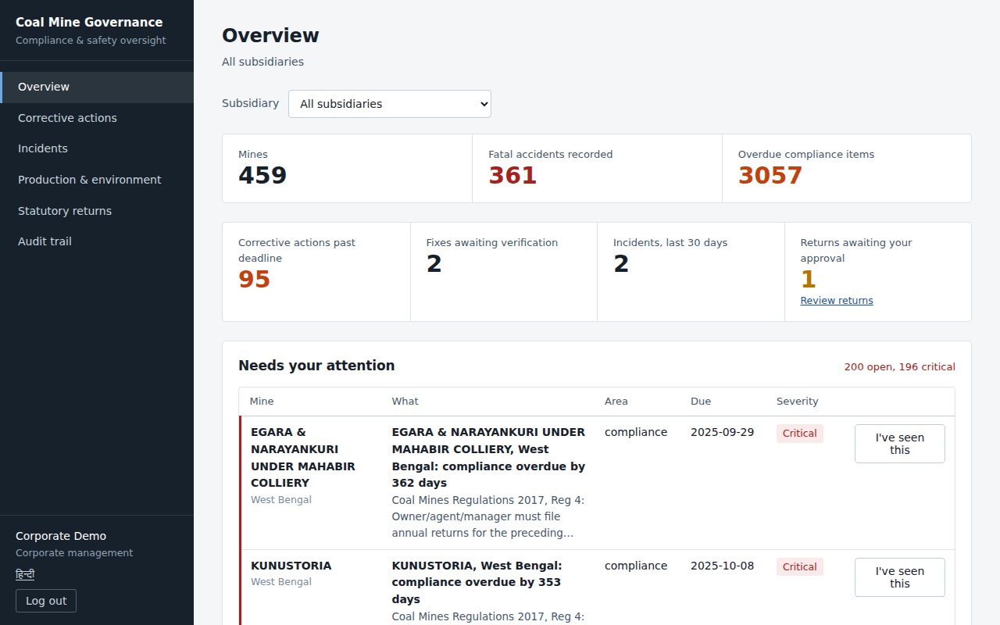

<div align="center">

# ⛏️ Coal Mining Smart Governance Platform

**Statutory compliance, safety findings and field inspections for Indian coal mining — in one record, visible to everyone accountable for it.**

[](https://nextjs.org/)
[](https://supabase.com/)
[](https://huggingface.co/spaces)
[](https://groq.com/)
[](https://web.dev/progressive-web-apps/)
[](https://github.com/hitengupta44-oss/COAL_GOV_SIH/releases/latest/download/coal-mine-governance.apk)
[](https://opentimestamps.org)
[](supabase/tests)

Smart India Hackathon 2026 · Problem Statement **SIH26024**

**[🌐 Open the live platform](https://coal-gov-sih.vercel.app)** · **[📱 Download the Android app](https://github.com/hitengupta44-oss/COAL_GOV_SIH/releases/latest/download/coal-mine-governance.apk)** · [Demo accounts](#-demo-accounts)

[Architecture](#-architecture) · [Setup](#-setup) · [Roles](#-the-seven-roles) · [Data sources](#-data-sources)

</div>

---

## The problem

Compliance in Indian coal mining lives in spreadsheets, paper registers and email
threads spread across the pit office, the safety office and corporate HQ. Nobody
knows a mine's real compliance position until an inspector asks for it.

This platform puts it in one record — and shows that record differently to each of
the seven people who need it.

## What it does

| | |
|---|---|
| 📋 **Compliance** | 29 statutory requirements from the Mines Act 1952 and Coal Mines Regulations 2017, tracked across **459 mines**. Obligations **recur on their statutory cycle** (weekly, monthly, annual): completing one schedules the next, a missed date turns Overdue on its own, and every obligation shows its 12-month track record. Completion can carry its proof (challan, certificate, photo) |
| 🔍 **Inspections → verified fixes** | Geo-tagged, photographed findings get a deadline by severity. The mine records the fix with photo evidence; **someone else** verifies it on site, or reopens it with a reason. Nobody can sign off their own fix — enforced in the database |
| 🚨 **Incidents** | Anyone at a mine can report an accident, dangerous occurrence or near miss, online or offline, with photo and location. Serious ones alert the mine, corporate and the regulator **instantly**. Fatal accidents, serious injuries, dangerous occurrences, fires, inundations and roof/side falls need a DGMS notice within 24 hours, and cannot be closed until it is on record |
| 🕒 **Attendance** | Personal check-in / check-out, geo-fenced against the mine. Identity and mine come from the login, not the request. Off-site records are flagged for the official. **Contract labour** without accounts is recorded by crew and shift by the supervisor, geo-tagged — an unapproved or blacklisted contractor cannot be recorded on site, and a crew working under a lapsed document alerts the mine at once |
| ⛏️ **Production** | Shift-wise production entry against a target set from the mine's **real annual output**. Each day is scored against the mine's own trailing 30 days; unexplained collapses and spikes are flagged |
| 🌫️ **Environment** | Air, water and noise readings checked against CPCB NAAQS, EP Rules Sch. VI and Noise Rules limits on entry. A breach alerts the mine; readings cannot be edited away. Each mine also shows **real CPCB data** for the town and rivers around it, and a mine's own published monitoring (from its EC compliance report) is loaded as real readings. **Analyser faults** — a station repeating the same value for days, or reading zero — are flagged automatically |
| 📑 **Statutory returns** | **Prepared automatically** on the 1st of each month for every mine (quarterly environmental returns at quarter end), with figures generated by the database from live records. Due by the 7th, with reminders and escalation if not submitted. SHA-256 fingerprinted at submission, approved or sent back by corporate, then filed to the regulator. Downloadable as PDF carrying the fingerprint |
| ✅ **Contractor approval** | A new contractor cannot work until approved by the mine official or corporate — never by whoever added them — and only with the safety training certificate, workmen compensation insurance, contract labour licence and PF registration on record and in date. Rejections go back with a reason |
| 🎯 **Risk analytics** | Six flag types — **recurring compliance failures** (the same obligation missed again and again), recurring inspection violations, anomalous accident rates, compliance gaps (vs peer mines), CPCB breaches, operational anomalies (production outliers, off-site records) |
| 🔮 **Prediction** | A logistic-regression model estimates, for every pending obligation, the chance it will be missed — with the reasons — and warns the mine 14 days ahead. "Likely" is set relative to the national miss rate, so warnings stay meaningful as the history grows. Cross-validated accuracy is published with every prediction |
| 🔔 **Alerts** | Addressed to a role at a mine. Real-time on open dashboards, device notifications, and **free email** (one digest per person per hour for High and Critical alerts). Unacknowledged alerts escalate upward; they close themselves when the issue is fixed |
| 🔗 **Tamper-evident audit** | Every change is recorded by the database itself and hash-chained. Nobody — including the database owner — can edit or delete it, and one click proves the chain is intact. Once a day the chain head is **anchored in the Bitcoin blockchain** (OpenTimestamps): anyone can verify the proofs at opentimestamps.org, and a later rewrite of the history is flagged against them |
| 📱 **Field app** | **Android app** (free download, see below) and installable web app on any phone, laid out for small screens. Inspections, incidents, check-ins and grievances — photos included — queue offline and sync with their real capture time |
| 📄 **OCR** | Photograph a paper observation sheet; Tesseract reads English and Hindi on-device |
| 🗣️ **Languages** | Field screens in Hindi or English; the assistant answers in Hindi, Bengali, Odia, Telugu, Marathi |
| 🗺️ **GIS** | Switchable layers: mines by risk band, a risk heatmap, open inspection findings (late and off-site ones marked), incidents of the last 90 days, check-ins made outside a mine's boundary (linked to the mine they claim), and each mine's geo-fence — its **lease boundary** where one is loaded (from a KML or its EC report), otherwise a radius around the mine |
| 💬 **Assistant** | Grounded in live data across all modules, scoped to exactly what your role may see |

## 📸 Screenshots

| Corporate overview | On a phone |
|---|---|
|  |  |

| Production & environment, with real CPCB data | A mine's own monitoring, with an analyser fault caught |
|---|---|
|  |  |

## 📱 Get the app

| Phone | How |
|---|---|
| **Android** | [Download the APK](https://github.com/hitengupta44-oss/COAL_GOV_SIH/releases/latest/download/coal-mine-governance.apk), open it, allow "Install unknown apps" once. Or tap **Download the Android app** on the login page |
| **iPhone** | Open [coal-gov-sih.vercel.app](https://coal-gov-sih.vercel.app) in Safari → Share → **Add to Home Screen** |
| **Any browser** | Chrome menu → **Install app** |

All three are the same platform: same logins, same offline support, camera and GPS. The
Android app is built free from the web app with [PWABuilder](https://www.pwabuilder.com)
and published as a GitHub release.

---

## 🏗️ Architecture

```
  FIELD                DATA                  INTELLIGENCE          GOVERNANCE
  ─────                ────                  ────────────          ──────────
  Android app · PWA →  Supabase Postgres  →  Risk scoring      →   7 dashboards
  GPS · OCR · photos   Row Level Security     Prediction            GIS · Reports
  Offline queue        Hash-chained audit     Alerts engine         Email alerts
                       CPCB + DGMS data       Groq LLM              Bitcoin anchor
       ▲                                                                 │
       └───────────  corrective actions return to the field  ────────────┘
```

<table>
<tr><td><b>Frontend</b></td><td>Next.js 14 · React · PWA (service worker + IndexedDB)</td></tr>
<tr><td><b>Backend</b></td><td>Python · Gradio on Hugging Face Spaces</td></tr>
<tr><td><b>Database</b></td><td>Supabase PostgreSQL with Row Level Security</td></tr>
<tr><td><b>AI</b></td><td>Groq <code>openai/gpt-oss-120b</code> · rule-based risk engine</td></tr>
<tr><td><b>Field</b></td><td>Tesseract.js OCR · browser Geolocation</td></tr>
<tr><td><b>Geo &amp; docs</b></td><td>Leaflet + OpenStreetMap + leaflet.heat · jsPDF</td></tr>
<tr><td><b>Integrity</b></td><td>SHA-256 hash chain in Postgres · OpenTimestamps (Bitcoin) anchoring</td></tr>
<tr><td><b>Jobs &amp; alerts</b></td><td>GitHub Actions (hourly and daily) · SMTP email (Gmail, free)</td></tr>
<tr><td><b>Mobile</b></td><td>Android app via PWABuilder (Trusted Web Activity) · installable PWA</td></tr>
</table>

<details>
<summary><b>Scaling beyond the demo</b></summary>

<br>

The demo runs on free tiers. The design does not depend on them:

| Concern | How it is handled |
|---|---|
| **More mines and subsidiaries** | Every rule is per mine (`mine_id`) and every oversight view filters by subsidiary. Adding a subsidiary or 5,000 mines is data, not code. Indexes cover the hot queries (compliance by mine and date, alerts by status, findings by deadline) |
| **Access control at scale** | Enforced by Postgres Row Level Security, so it holds however many frontends, apps or integrations call the database |
| **Backend instances** | The backend is stateless: identity comes from the Supabase token, and rate limiting lives in the database (`hit_rate_limit`), so any number of instances can run behind a load balancer. It moves from Hugging Face to any container host (Cloud Run, ECS, NIC cloud) unchanged |
| **Scheduled work** | Jobs are idempotent (re-running creates nothing twice) and run from any scheduler — GitHub Actions here; `pg_cron`, Kubernetes CronJobs or a state data centre scheduler in production |
| **Field connectivity** | Offline-first: records, photos and capture times queue on the device and sync when a signal returns |
| **Data growth** | History is append-only and indexed by mine and date; partitioning `compliance_tracking` and `audit_log` by year is the next step past tens of millions of rows |
| **Sovereign hosting** | Every component is open source (Postgres, PostgREST, Next.js, Python) and can be self-hosted in an Indian government cloud (MeghRaj / NIC) |

</details>

---

## 👥 The seven roles

The same record, seen differently — with different powers over it.

| Role | Sees | Can do |
|---|---|---|
| 👷 **Worker** | Own grievances, own attendance | File grievances, check in/out, report incidents |
| 🔍 **Inspector** | Own mine's findings and incidents | Geo-tagged inspections with photos, **verify or reopen fixes**, environmental readings |
| 🏭 **Mine official** | Everything at their mine | Compliance with proof, record fixes, investigate incidents, production and environment returns, prepare statutory returns |
| 📋 **Contractor manager** | Contractors at their mine | Add contractors for approval, record documents with scans, record crew attendance, blacklist |
| 🏢 **Corporate** | All mines, by subsidiary | **Approve or send back returns**, verify fixes, everything a mine official can do |
| ⚖️ **Regulator** | All mines, approved returns, audit trail | **Observe only** — and verify the audit chain |
| 🛠️ **Administrator** | Who has access | Approve accounts, assign roles |

<details>
<summary><b>Why the regulator can't edit anything</b></summary>

<br>

Not a compliance status, not a grievance, not a risk flag. Oversight that can
quietly clear its own findings isn't oversight, and an audit trail the observer
can edit is worthless.

Equally, the **mine official is the only role that can both see and act** on
nearly everything at its site — accountability sits there, so the powers do too.
Closing a grievance requires writing what was actually done; a status flag alone
records that somebody clicked something, not that anything happened.

</details>

<details>
<summary><b>How the loops connect</b></summary>

<br>

**Inspection** — finding recorded at the face with GPS and a photo (or drafted from a
paper sheet by OCR) → geo-fence checked → deadline set by severity → mine official
records the fix with photo evidence → a *different* inspector verifies on site →
closed, or reopened with a reason and a shorter deadline → missed deadlines turn
Overdue and escalate.

**Incident** — reported by anyone at the mine, even offline → severity and DGMS
notifiability derived → mine, corporate and regulator alerted instantly → official
investigates, records the DGMS notice reference → closes only with findings and a
root cause → incident counts flow into the monthly return.

**Compliance** — prediction warns 14 days ahead that an item is likely to slip →
deadline passes → alert → official completes it with proof → audit trail records
who, when and what evidence → figures roll into the return.

**Return** — database generates the month's figures → official reviews and submits
(fingerprinted) → corporate approves or sends back → regulator receives the approved
filing → anyone can later prove the PDF is the approved content.

**Grievance** — worker files → mine official resolves with a note → worker reads the
outcome → corporate sees which mines answer late. The complaint text never enters the
audit trail or the assistant's view of other people.

**Risk** — analytics flags a mine → official marks it addressed *or disputes it*, with
a note → corporate and regulator see both the finding and the answer.

</details>

---

## 🔐 Access control

**Enforced in the database, not the interface.** Every table carries Row Level
Security policies. A worker querying another mine's grievance gets zero rows —
not a hidden button, an empty result. A direct API call with a valid token returns
only what that person may see.

**Roles cannot be self-assigned.** A new signup gets no profile row and reaches no
dashboard until an admin assigns one. Only admins can write to `user_profiles`.

**Identity is derived, never submitted.** An inspection records the inspector from
their verified session, so nothing can be filed under someone else's name.

**Workflows are enforced by the database too.** The recorded observation on an
inspection, the text of an incident report and the figures in a submitted return
cannot be edited by anyone. A fix must be verified by someone other than the person
who recorded it; a return must be approved by someone other than its submitter.
The same rules apply to a direct API call as to the app.

**Evidence is private.** Photos and documents live in a private storage bucket,
readable only by people at the same mine and oversight roles, served through
short-lived links, and cannot be overwritten or deleted.

**Anchored in public.** Once a day the audit chain's latest hash is stamped into the
Bitcoin blockchain with OpenTimestamps (free, no wallet). The Audit page lists every
anchor and flags any whose anchored entry no longer matches today's chain — so even
someone with full database access cannot rewrite history unnoticed. Anyone can check
a proof at [opentimestamps.org](https://opentimestamps.org) without trusting this platform.

**Tested.** `supabase/tests/` builds a fresh database from the migrations and runs
149 checks as each role — including the attempts that must fail. They run on every
push that touches `supabase/`.

---

## 📂 Structure

```
backend/
  app.py                           Gradio app; each function is a REST endpoint
  requirements.txt

frontend/
  pages/dashboard/                 7 role dashboards + actions, incidents, attendance,
                                   operations, returns, audit
  components/                      Layout, UI kit, alerts, chat, map, reports, OCR,
                                   evidence (photos), predictions
  lib/                             Supabase client, auth, API, offline queue + sync,
                                   geolocation, evidence upload, i18n (Hindi/English)
  pages/api/assetlinks.js          Android app verification (/.well-known/assetlinks.json)
  public/                          PWA manifest, service worker, icons, app screenshots

supabase/
  schema.sql                       Tables, views, RLS policies
  migration_02_workflow.sql        Grievance workflow, contractor compliance
  migration_03_alerts.sql          Alerts and escalation
  migration_04_view_security.sql   Closes an RLS bypass in views
  migration_05_flag_response.sql   Lets mines answer risk flags
  migration_06_rls_hardening.sql   RLS on every table, append-only audit log
  migration_07_field_operations.sql  Corrective actions, incidents, attendance,
                                   production, environment, evidence, geo-fence,
                                   database-level audit triggers
  migration_08_returns_and_audit_chain.sql  Statutory returns + approval,
                                   hash-chained audit log
  migration_09_predictions.sql     Predictive compliance
  migration_10_governance_completion.sql  Recurring obligations, recurring-failure
                                   flag, contractor approval, crew attendance,
                                   automatic returns, shared rate limiting
  migration_11_real_data.sql       Real production basis, CPCB air quality per mine
  migration_12_real_monitoring.sql River water quality per mine, published monitoring
                                   data, lease-boundary geo-fences
  migration_13_incident_notice.sql Roof/side falls need a DGMS notice
  migration_14_blockchain_anchor.sql  Bitcoin anchors of the audit chain
  load_seed_data.py                DGMS + CIL source data
  apply_real_data.py               Real output, air-quality links, real mines for demo records
  load_real_monitoring.py          CPCB river data 2024, EC-report monitoring, lease extent
  load_lease_boundary.py           Attach a lease polygon from a KML file
  raw_data/                        Source datasets (DGMS, CPCB, Coal Ministry, EC reports)
  seed_*.py                        Demo users, obligations, workflow + field data
  risk_scoring_job.py              Risk flags (daily)
  predictive_job.py                Predictions + early warnings (daily)
  alerts_engine.py                 Alerts, reminders, escalation, email (hourly)
  publish_audit_anchor.py          Verifies the audit chain; anchors it in Bitcoin daily
  tests/                           Policy and workflow tests

.github/workflows/
  governance-jobs.yml              Runs the jobs on schedule (alerts, email, analytics,
                                   audit anchoring)
  db-tests.yml                     Runs the database tests on every change
```

---

## 🚀 Setup

Order matters — each step depends on the one before.

### 1. Database

Create a Supabase project. In the SQL Editor run `schema.sql`, then migrations
`02` → `14` **in order**. Under **Authentication → Email**, turn *off* email
confirmation so demo logins work immediately. Migration 07 creates the private
`evidence` storage bucket and adds `alerts` to Realtime.

### 2. Seed data and first analytics run

```bash
cd supabase
pip install -r requirements.txt

python load_seed_data.py            # mines, accidents, production
python seed_compliance_tracking.py  # statutory obligations
python seed_demo_users.py           # one account per role
python seed_workflow_data.py        # contractor docs, grievance state
python seed_compliance_history.py   # 6 months of past occurrences
python seed_field_operations.py     # production, environment, attendance,
                                    # incidents, actions, returns,
                                    # contractors and crew
python load_real_monitoring.py      # CPCB rivers 2024, EC-report monitoring,
                                    # lease extent
python risk_scoring_job.py          # risk flags
python predictive_job.py            # predictions + early warnings
python alerts_engine.py             # alerts and escalation
```

Each prompts for your Supabase URL and service-role key. Nothing is written to disk.

### 2b. Schedule the jobs

Add repository secrets `SUPABASE_URL` and `SUPABASE_SERVICE_ROLE_KEY` (optionally
`GROQ_API_KEY`). `.github/workflows/governance-jobs.yml` then runs the alerts engine
hourly and the analytics daily, verifies the audit chain on every run and anchors it
in Bitcoin once a day. Run it by hand from the Actions tab once to check.

**Email alerts (free):** create a Gmail app password and add `SMTP_HOST`
(`smtp.gmail.com`), `SMTP_PORT` (`587`), `SMTP_USER`, `SMTP_PASSWORD`,
`ALERT_EMAIL_FROM`. For the demo, also set `ALERT_EMAIL_REDIRECT` to your own inbox:
the demo accounts' addresses are not real, so their alerts come to you instead, each
naming the person it was for.

### 3. Backend → Hugging Face Spaces

Push `backend/app.py` and `requirements.txt` to a Gradio Space. Add four secrets:

```
SUPABASE_URL
SUPABASE_SERVICE_ROLE_KEY
SUPABASE_ANON_KEY
GROQ_API_KEY
```

### 4. Frontend → Vercel

Import the repo, set **root directory** to `frontend`, and add:

```
NEXT_PUBLIC_SUPABASE_URL
NEXT_PUBLIC_SUPABASE_ANON_KEY
NEXT_PUBLIC_BACKEND_URL        # your Space URL, no trailing slash
```

### 5. Android app

On [pwabuilder.com](https://www.pwabuilder.com), enter the site URL → Package for
stores → Android. Put the two values from its `assetlinks.json` into Vercel as
`ANDROID_PACKAGE` and `ANDROID_SHA256` (so the app opens full screen), and publish the
APK as a GitHub release named `coal-mine-governance.apk` — the login page's download
button points there.

> Full detail and known failure modes: [`DEPLOYMENT.md`](DEPLOYMENT.md)

---

## 🔑 Demo accounts

All use the password `CoalDemo#2026`.

| Email | Role |
|---|---|
| `admin@coaldemo.in` | Administrator |
| `corporate@coaldemo.in` | Corporate management |
| `regulator@coaldemo.in` | Regulator |
| `manager@coaldemo.in` | Mine official |
| `inspector@coaldemo.in` | Field inspector |
| `contractor@coaldemo.in` | Contractor manager |
| `worker@coaldemo.in` | Worker |

> [!WARNING]
> Deliberately weak, publicly known demo passwords. Never reuse them against a
> database holding real data.

<details>
<summary><b>Try this first</b></summary>

<br>

Ask the assistant **"Which mines have overdue compliance?"** as
`corporate@coaldemo.in` — you'll get several mines. Ask the identical question as
`manager@coaldemo.in` — you'll get only their own.

Same question, same system, different answer, purely because of who's asking. And
it's enforced in Postgres, not the UI.

Then, as `corporate@coaldemo.in`, open **Production & environment** and pick
**Pakri Barwadih** — real readings from the mine's own air-quality station, and the
platform catching its analyser stuck at one value for 35 days. Finally, as
`regulator@coaldemo.in`, open **Audit trail**: the chain verifies in one click, and
its daily Bitcoin anchors can be checked independently at opentimestamps.org.

</details>

---

## 📚 Data sources

Compliance requirements are **transcribed directly** from the Acts and
Regulations, not paraphrased.

- The Mines Act, 1952 · Coal Mines Regulations, 2017 — DGMS
- Mines Rules, 1955 · Contract Labour (R&A) Act, 1970
- DGMS annual report — inspections, improvement notices, prosecutions
- DGMS fatal & serious accident statistics, owner-wise, 2017–2024
- Indian Coal Mines Dataset (Jan 2021) — 459 mines, location, owner and **actual
  2019-20 output**, which sets each mine's daily production target
- CPCB ambient air quality, 2023 annual averages — each mine is linked to its nearest
  monitoring city (within 60 km) and compared with the NAAQS 2009 annual limits
- CPCB river water quality, NWMP 2024 — 1,555 stations; 66 on coal-belt rivers placed
  on the map, linked to 260 mines and checked against CPCB's bathing-water criteria
- Six-monthly EC compliance reports — Pakri Barwadih (NTPC): 183 days of its own
  continuous air-quality station, Oct 2023–Mar 2024; Jamuniya UG (WCL): lease extent
- CPCB National Ambient Air Quality Standards, 2009 · CPCB river water quality (Yamuna, 2025)
- Rajya Sabha unstarred questions on coal production and safety

Attendance, contractor, grievance and field-inspection records are **synthetic**,
generated to demonstrate the workflows, and flagged as such in the database. They
are attached to real mines under their real subsidiaries, with inspection positions
at the mine. Daily production figures are synthetic around each mine's real output.

---

## 🚧 Not built

Stated here rather than discovered later.

- **Play Store / App Store listing** — the Android app installs from its APK and
  iPhones use Add to Home Screen; store listings need paid developer accounts
- **Lease boundaries for every mine** — the geo-fence follows a mine's lease polygon
  where one is loaded (KML, or the extent stated in its EC report; one mine so far).
  Elsewhere it is a radius around the mine's point (5 km exact, 25 km approximate)
- **Real compliance history for the model** — the predictive pipeline is real, but
  the seed compliance statuses are synthetic, so its accuracy on seed data (AUC ≈ 0.70)
  says little about real performance. It prints and stores its cross-validated AUC
  so this is never hidden
- **SMS** — alerts reach people in-app, as device notifications and by email, all
  free; SMS needs a paid gateway (e.g. MSG91, Twilio)
- **Official DGMS form layouts** — returns carry the statutory figures and an
  approval record, not a reproduction of each prescribed form
- **Instant blockchain confirmation** — Bitcoin anchors confirm a few hours after
  they are made, once a day; changes made since the last anchor are protected by the
  hash chain and the GitHub record until the next one

---

<div align="center">
<sub>Built for Smart India Hackathon 2026 · Problem Statement SIH26024</sub>
</div>
